  

  

  <a href="https://twitter.com/AnirudhWith">twitter</a>
  &nbsp;&nbsp;•&nbsp;&nbsp;
  <a href="https://linkedin.com/in/anirudhsriramb">linkedin</a>
  &nbsp;&nbsp;•&nbsp;&nbsp;
  <a href="https://techwithanirudh.com">website</a>

  
GitHub Stats ⚡

  

    <picture>
      <source media="(prefers-color-scheme: dark)"  srcset="./.github/assets/stats/dark.svg" />
      <source media="(prefers-color-scheme: light)" srcset="./.github/assets/stats/light.svg" />
      
    </picture>
  

---

## Projects

| Project | Description |
|:---|:---|
| [**portfolio**](https://github.com/techwithanirudh/portfolio) | My portfolio website |
| [**shadcn-portfolio**](https://github.com/techwithanirudh/shadcn-portfolio) ⭐ 200+ | Sleek portfolio built with shadcn |
| [**shadcn-saas-landing**](https://github.com/techwithanirudh/shadcn-saas-landing) ⭐ 50+ | Customizable SaaS landing template with shadcn |
| [**discord-ai-bot**](https://github.com/techwithanirudh/discord-ai-bot) | AI Discord bot with human-like tools, tasks, and voice |
| [**coolify-tweaks**](https://github.com/techwithanirudh/coolify-tweaks) ⭐ 150+ | Theme tweaks reimagining Coolify's v5 design |
| [**speaking-meeting-bot**](https://github.com/Meeting-BaaS/speaking-meeting-bot) | Fully autonomous speaking bots using MeetingBaas API + Pipecat |
| [**transcript-seeker**](https://github.com/Meeting-BaaS/transcript-seeker) | Browser-based AI transcript viewer & manager with meeting bot integration |
| [**discourse-ai-bot**](https://github.com/techwithanirudh/discourse-ai-bot) | AI bot for Discourse built with Nitro + HeyAPI (OpenAPI gen) |
| [**better-auth-nextjs-starter**](https://github.com/techwithanirudh/better-auth-nextjs-starter) | Updated Next.js auth starter inspired by Daveyplate |
| [**fumadocs-starter**](https://github.com/techwithanirudh/fumadocs-starter) ⭐ 50+ | Full Fumadocs starter with AI features + built-in plugins |
| [**ai-chatbot**](https://github.com/techwithanirudh/ai-chatbot) | Revamped Vercel Chat SDK with improved auth & design |
<!--
| [discord-bot-starter](https://github.com/techwithanirudh/discord-bot-starter) | Type-safe Discord bot starter with Bun + AI SDK |
| [stylus-theme-starter](https://github.com/techwithanirudh/stylus-theme-starter) | Starter kit for building production-ready themes with Stylus |
| [discourse-bot-starter](https://github.com/techwithanirudh/discourse-bot-starter) | Minimal starter template for Discourse Chat bots |
| [nextjs-starter](https://github.com/techwithanirudh/nextjs-starter) | My ideal Next.js setup with Biome, Lefthook, CommitLint, Bun, and more |
| [ai-sdk-nano-banana](https://github.com/techwithanirudh/ai-sdk-nano-banana) | Nano Banana AI SDK starter built on nextjs-starter |
| [expo-better-auth-starter](https://github.com/techwithanirudh/expo-better-auth-starter) | Fully fledged Expo + Better-Auth starter built with Nativewind |
-->

---

<picture>
  <source media="(prefers-color-scheme: dark)"  srcset="./.github/assets/snake/dark.svg" />
  <source media="(prefers-color-scheme: light)" srcset="./.github/assets/snake/light.svg" />
  
</picture>
