  

 

  

  
  

---

## Projects

- [portfolio](https://github.com/techwithanirudh/portfolio) · My portfolio website
- [shadcn-portfolio](https://github.com/techwithanirudh/shadcn-portfolio) · Sleek portfolio built with shadcn · ⭐200+  
- [shadcn-saas-landing](https://github.com/techwithanirudh/shadcn-saas-landing) · Customizable SaaS landing template with shadcn · ⭐50+  
- [discord-ai-bot](https://github.com/techwithanirudh/discord-ai-bot) · AI Discord bot with human-like tools, tasks, and voice  
- [coolify-tweaks](https://github.com/techwithanirudh/coolify-tweaks) · Theme tweaks reimagining Coolify's v5 design · ⭐150+
- [speaking-meeting-bot](https://github.com/Meeting-BaaS/speaking-meeting-bot) · Fully autonomous speaking bots using MeetingBaas API + Pipecat  
- [transcript-seeker](https://github.com/Meeting-BaaS/transcript-seeker) · Browser-based AI transcript viewer & manager with meeting bot integration  
- [discourse-ai-bot](https://github.com/techwithanirudh/discourse-ai-bot) · AI bot for Discourse built with Nitro + HeyAPI (OpenAPI gen)  
- [better-auth-nextjs-starter](https://github.com/techwithanirudh/better-auth-nextjs-starter) · Updated Next.js auth starter inspired by Daveyplate  
<!--
- [discord-bot-starter](https://github.com/techwithanirudh/discord-bot-starter) · Type-safe Discord bot starter with Bun + AI SDK  
- [stylus-theme-starter](https://github.com/techwithanirudh/stylus-theme-starter) · Starter kit for building production-ready themes with Stylus  
- [discourse-bot-starter](https://github.com/techwithanirudh/discourse-bot-starter) · Minimal starter template for Discourse **Chat** bots  
-->
- [fumadocs-starter](https://github.com/techwithanirudh/fumadocs-starter) · Full Fumadocs starter with AI features + built-in plugins · ⭐50+   
- [ai-chatbot](https://github.com/techwithanirudh/ai-chatbot) · Revamped Vercel Chat SDK with improved auth & design
<!--
- [nextjs-starter](https://github.com/techwithanirudh/nextjs-starter) · My ideal Next.js setup with Biome, Lefthook, CommitLint, Bun, and more  
- [ai-sdk-nano-banana](https://github.com/techwithanirudh/ai-sdk-nano-banana) · Nano Banana AI SDK starter built on nextjs-starter  
- [expo-better-auth-starter](https://github.com/techwithanirudh/expo-better-auth-starter) · Fully fleged Expo + Better-Auth starter built with Nativewind
-->

---

  
  &nbsp;
  

  <picture>
    <source media="(prefers-color-scheme: dark)"  srcset="./profile/snake-dark.svg" />
    <source media="(prefers-color-scheme: light)" srcset="./profile/snake.svg" />
    
  </picture>

